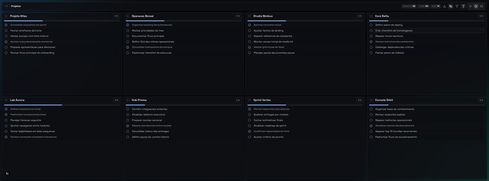

# Kids Projects

### Visao Geral

Kids Projects e um painel visual para organizar varios projetos em uma unica tela, com foco em velocidade operacional, leitura rapida e acompanhamento diario.

Cada projeto vive em um card proprio com checklist editavel, progresso visivel e persistencia local. O produto foi desenhado para funcionar como um cockpit compacto de execucao, sem desperdiçar area util da tela.

### Proposta de Valor

O painel foi pensado para quem precisa enxergar muitos projetos ao mesmo tempo e transformar ideias em proximos passos claros.

Principais ganhos:

- visao simultanea de ate 8 projetos em uma grade fixa
- criacao e edicao inline de titulos e tarefas
- marcacao rapida de tarefas concluídas
- exportacao estruturada em JSON
- base pronta para futura sincronizacao com backend ou nuvem
- temas visuais para diferentes contextos de uso

### O Produto

O dashboard ocupa a tela inteira e mantem alta densidade de informacao.



Funcionalidades atuais:

- grade fixa `4 x 2`
- cards de projeto com titulo editavel
- tarefas editaveis com conclusao por bolinha dedicada
- criacao inline de novos itens dentro do card
- persistencia local em SQLite com revisao de servidor
- exportacao manual do estado atual
- temas `light`, `dark` e `blue`
- opcao de aumentar a fonte dos titulos dos projetos
- healthcheck em `/api/health`
- templates de `launchd`, watchdog e backup agendado de `data/`
- CLI local `kids` para operacao, backup, health e leitura do estado

### Estrutura dos Dados

O estado do painel e salvo de forma estruturada em SQLite local, com snapshots JSON incrementais para backup e recuperacao.

Exemplo:

```json
{
  "version": 1,
  "revision": 4,
  "updatedAt": "2026-03-13T19:42:14.401Z",
  "theme": "dark",
  "projectTitleSize": "normal",
  "projects": [
    {
      "id": "p1",
      "title": "kids-architect",
      "items": [
        {
          "id": "p1-1",
          "text": "melhorar a heuristica de leitura da planta 2d",
          "done": false
        }
      ]
    }
  ]
}
```

### Stack

- Next.js 16
- React 19
- TypeScript
- Tailwind CSS v4
- Framer Motion
- Lucide React

### Como Rodar

Instale as dependencias:

```bash
npm install
```

Suba o projeto em desenvolvimento:

```bash
npm run dev -- --port 46321
```

Abra no navegador:

```text
http://localhost:46321
```

### Scripts

```bash
npm run cli -- help
npm run dev
npm run build
npm run start
npm run start:prod
npm run lint
npm run rebuild:native
npm run healthcheck
npm run backup:data
npm run install:launchd
npm run uninstall:launchd
```

### CLI

O projeto agora inclui uma CLI inspirada na estrutura do `mark-cli`, mas orientada ao dominio do `kids-projects`.

Uso direto:

```bash
./cli/kids.sh help
npm run cli -- help
```

Para instalar o comando `kids` com autocomplete no zsh:

```bash
source ./cli/install.sh
```

Comandos iniciais:

- `kids serve`
- `kids health`
- `kids state --summary`
- `kids backup`
- `kids install launchd`
- `kids uninstall launchd`

Se a versao do Node mudar entre instalacoes, o projeto tenta recompilar `better-sqlite3` automaticamente antes de subir o servidor ou rodar comandos Node da CLI. Se quiser forcar manualmente:

```bash
npm run rebuild:native
```

Se voce alterar a porta padrao ou trocar o Node usado pelo projeto, reinstale os agentes do `launchd` para atualizar os binarios e variaveis persistidas:

```bash
kids uninstall launchd
kids install launchd
```

Convencoes da CLI:

- comandos em `cli/commands/`
- suporte a `.sh`, `.mjs` e `.js`
- `# desc:` ou `// desc:` para help automatico
- prefixo `_` para comandos privados
- prefixo `util_` para arquivos utilitarios invisiveis no help

### Organizacao do Codigo

- `app/page.tsx`: tela principal, interacoes e fluxo do dashboard
- `app/dashboard-state.ts`: tipos, estado inicial, parse e persistencia estruturada
- `app/api/dashboard-state/store.ts`: store SQLite, migracao do JSON legado, revisoes e backups
- `app/api/health/route.ts`: healthcheck de leitura e escrita do store
- `app/globals.css`: tokens visuais, temas e classes do painel
- `app/layout.tsx`: shell raiz, metadata e fonts
- `cli/`: CLI local do projeto, catalogo de comandos e guia para agentes
- `launchd/`: templates de agentes para boot, watchdog e backup
- `scripts/`: start local de producao, watchdog, backup e instalacao do launchd
- `AGENTS.md`: contexto de projeto para agentes e IAs

### Operacao Local

- Store principal: `data/dashboard-state.sqlite`
- Backups incrementais: `data/backups/*.json`
- Backups agendados do diretório `data/`: `data/archives/*.tar.gz`
- Healthcheck: `GET /api/health`
- Instalação de agentes `launchd`: `npm run install:launchd`
- `kids health` faz fallback para diagnostico local do store quando o HTTP nao responde e aponta divergencias de porta do `launchd`

### Posicionamento

Este projeto nao e apenas um checklist em grade. Ele serve como uma base de produto para um painel de projetos que pode evoluir para:

- sincronizacao em nuvem
- colaboracao entre usuarios
- backup e restore automatizado
- filtros e agrupamentos por contexto
- templates de projetos
- integracoes com ferramentas externas

### Cuidados de Repositorio

O repositório esta configurado para nao versionar artefatos locais e sensiveis, como:

- `node_modules`
- `.next`
- `.env`
- logs
- artefatos locais de automacao do Playwright

Se houver futura sincronizacao com backend, segredos e tokens devem continuar fora do repositório e ser gerenciados por variaveis de ambiente ou secret managers.
